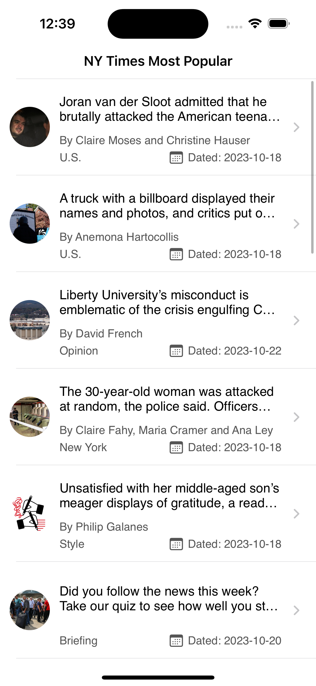
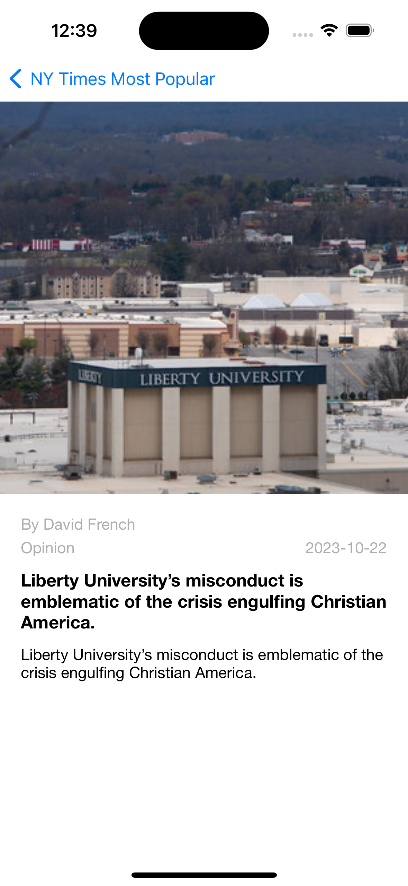
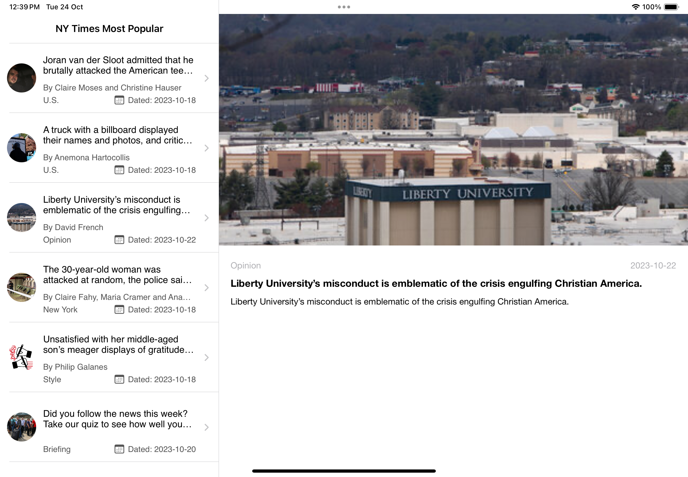
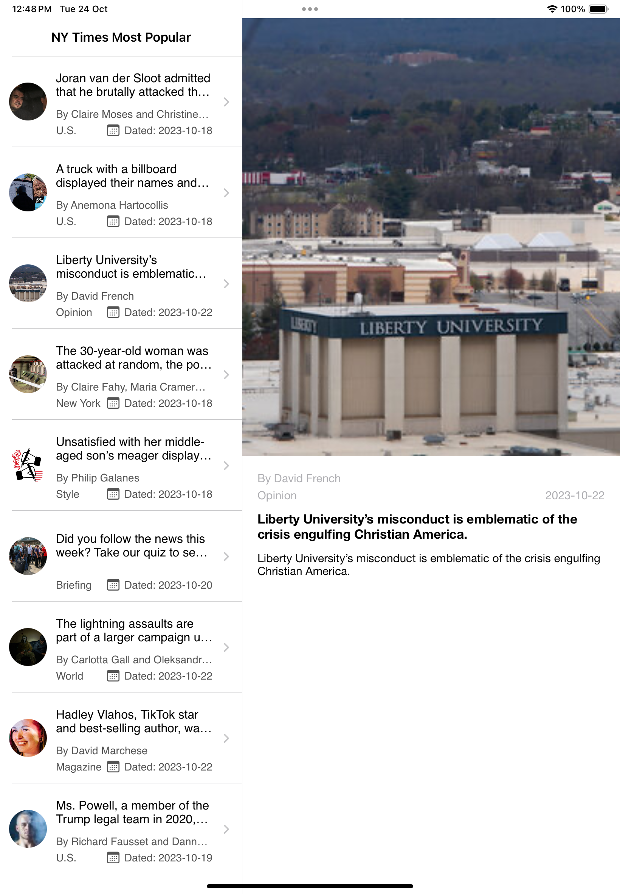

# NYTimes Popular Articles App


## Overview

This GitHub repository contains a demo iOS app that displays a list of the most popular articles from the New York Times website. The app is built using the MVVM (Model-View-ViewModel) architectural pattern and utilizes Swift Concurrency for asynchronous operations. It also includes a suite of unit tests to ensure code quality and reliability.

## Enviornment
To run this project, you'll need the following:

- Xcode (version 15.0)
- Swift (version 5.0)
- iOS Target (version 13.0+)

## Getting Started

Follow these steps to get the app up and running on your local development environment:

1. Clone the repository to your local machine.

```bash
git clone https://github.com/syedzainulabideen/NYTimes.git
```


## Screenshots:






